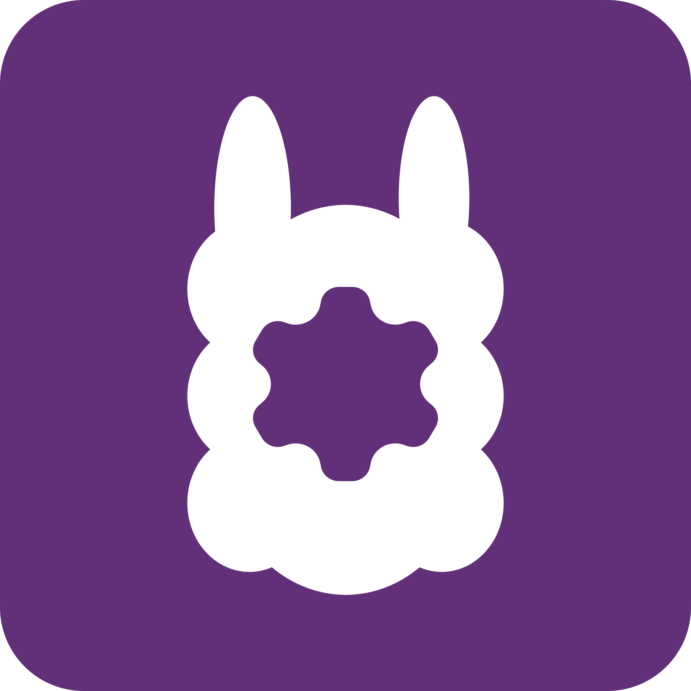

# Welcome to my GitHub profile!

My name is Martin Bartos, and I am studying Computer Science at the University of Szeged. My goal is to bring my ideas to life and pursue a successful career in programming. Here is a brief overview of my skills and the projects I am working on or have worked on.

## 🛠️ Skills and Experience

| Programming language | Experience and knowledge |
|-|-|
| C | ● |
| C++ | ● |
| C# | ●●●●●●●● |
| Java | ●● |
| JavaScript/TypeScript | ●●● |
| Python | ●● |

*Last updated: Nov 18 2025*

## 🧑‍💻 Projects

    
    <h2>Avallama</h2>

A **multi-platform desktop app** designed to enable a user-friendly **GUI for Ollama**. I have been working on this project with my friend as a team.

#### Tech stack
- C#, Avalonia - (Windows, Linux, macOS)

#### Current release: v0.1.1

#### *This project is under active development..*

https://github.com/4foureyes/avallama

---

    
    <h2>Stuffort</h2>

A simple **productivity focused mobile app** to store to-do lists with different categories. It has a built-in timer that can be used to finish assigned tasks while it also saves statistics. This was made to be a solo hobby project.

#### Tech stack
- C#, Xamarin - (Android)

#### *This project is archived and not maintained since May 2021*

https://github.com/bmartin042503/stuffort

---

    
    <h2>ngTravel</h2>

A **bus ticket reservation system** made for a university course project using the Angular framework.

#### Tech stack
- Angular, TypeScript, Firebase

#### *This project is partially finished and not maintained since May 2025*

https://github.com/bmartin042503/ngtravel

---

    
    <h2>rfsocial</h2>

A simple **social media web application** that I have worked on with six people. It was made as an assignment for a university course.

#### Tech stack
- Node.js, EJS, PostgreSQL

#### *This project is partially finished and not maintained since Dec 2024*

https://github.com/rfsocial/rfsocial
